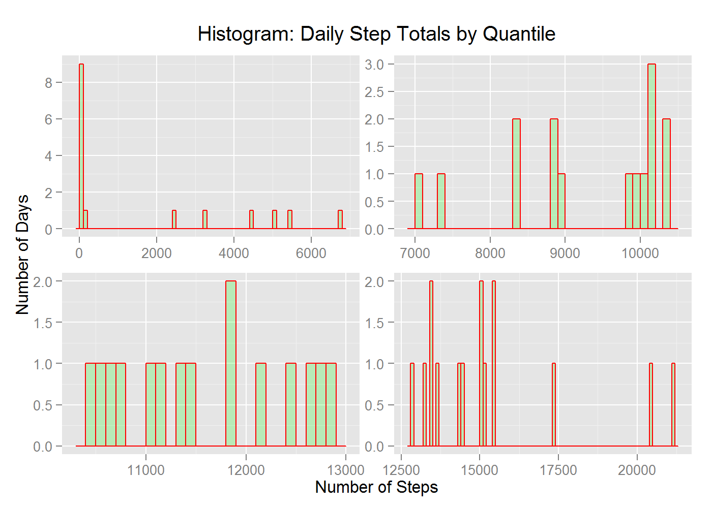
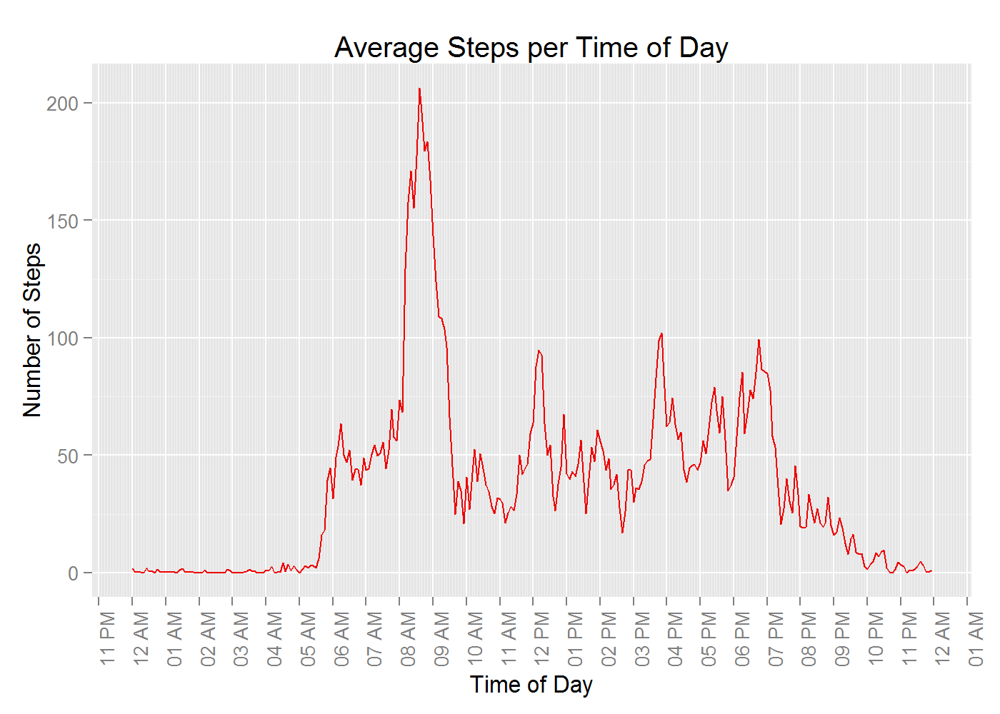
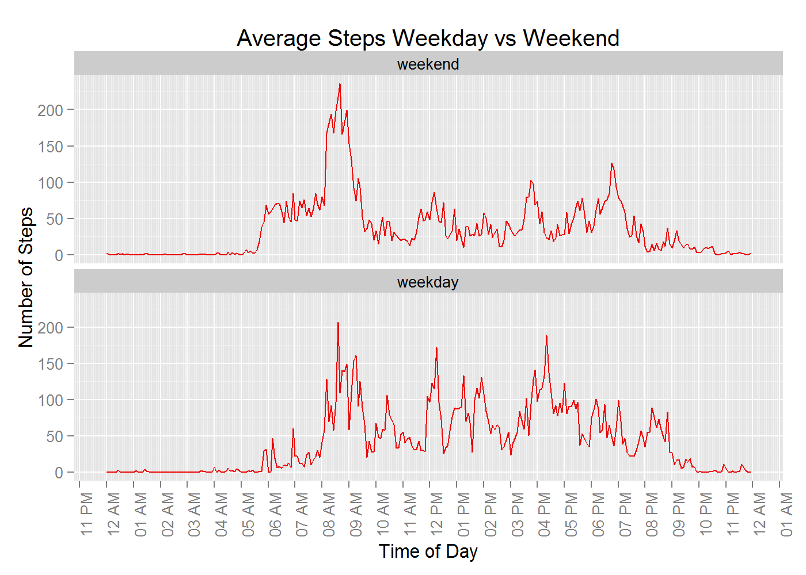

# Reproducible Research: Peer Assessment 1


## Loading and preprocessing the data

Data set for analysis can be found at the following URL.  

[Activity monitoring data](https://d396qusza40orc.cloudfront.net/repdata%2Fdata%2Factivity.zip)

### Load libraries


```r
library(data.table)
library(plyr)
library(dplyr)
library(ggplot2)
library(scales)
library(chron)
library(knitr)

opts_chunk$set(out.width='900px', dpi=200)
```

### Download, unpack and read data set.


```r
file.name.zip <- "repdata-data-activity.zip"
file.url <- "https://d396qusza40orc.cloudfront.net/repdata%2Fdata%2Factivity.zip"
file.name <- "activity.csv"

if(!file.exists(file.name.zip)) {
    download.file(url = file.url, destfile = file.name.zip)
    unzip(file.name.zip)
}

colClasses <- c("steps" = "integer", "date" = "POSIXct",  "interval" = "integer")

activity <- as.data.table(read.csv(file.name, colClasses = colClasses, stringsAsFactors=FALSE))
```

## What is mean total number of steps taken per day?

### Calculate total steps per day ignoring NA values.  


```r
steps_per_day <- activity %>% 
    group_by(date) %>% 
    summarise(steps = sum(steps, na.rm = TRUE))

# break steps by quantiles for better plotting
steps_per_day$qSPD <- cut(steps_per_day$steps, 
                          breaks = quantile (steps_per_day$steps, probs = c(0, .25, .50, .75, 1)), 
                          include.lowest = TRUE,
                          dig.lab = 5)
```

### Plot of Histogram of the total steps per day. 


```r
steps_hist <- ggplot(data = steps_per_day, aes(steps))
steps_hist <- steps_hist + geom_histogram(col="red", 
                 fill="green", 
                 alpha = .2,
                 binwidth=100)
steps_hist <- steps_hist + labs(title = "Histogram: Daily Step Totals by Quantile", x = "Number of Steps", y = "Number of Days")
steps_hist <- steps_hist + facet_wrap(~qSPD, ncol=2, scales="free")
steps_hist <- steps_hist + scale_y_continuous(breaks= pretty_breaks())
steps_hist <- steps_hist + theme(strip.background = element_blank(), strip.text = element_blank())
steps_hist
```



### Mean and median of the total number of steps taken per day


```r
mean <- round(mean(steps_per_day$steps))
median <- median(steps_per_day$steps)
```

**mean**: ~ 9354 (rounded to nearest step)  
**median**: 10395  


## What is the average daily activity pattern?

### Calculate Mean Values

```r
ave_daily_activity <- activity %>% group_by(interval) %>% 
    summarise(mSteps = mean(steps, na.rm = TRUE))

# convert interval to time
ave_daily_activity <- ave_daily_activity %>% 
    mutate(time = sprintf("%04d", interval)) %>% 
    mutate(time = as.POSIXct(time, format="%H%M", tz="GMT"))
```

### Time Series Plot: 5-minute interval (x-axis) -- average number of steps taken, averaged across all days (y-axis)


```r
ave_da_time <- ggplot(ave_daily_activity, aes(x = time, y = mSteps))
ave_da_time <- ave_da_time + geom_line(color = "red2", size = .5)
ave_da_time <- ave_da_time + scale_x_datetime(breaks = date_breaks("1 hour"), minor_breaks = "5 min", labels = date_format("%I %p"))
ave_da_time <- ave_da_time + labs(title = "Average Steps per Time of Day", x = "Time of Day", y = "Number of Steps")
ave_da_time <- ave_da_time + theme(axis.text.x = element_text(angle = 90, hjust = 1))
ave_da_time
```



### Interval with the Maximum Step Average 


```r
max_int_df <- ave_daily_activity %>% filter(mSteps == max(mSteps))
max_int <- max_int_df$interval
max_ave <- round(max_int_df$mSteps)
time_of_day <- format(max_int_df$time, format("%I:%M %p"))
```
**Interval**: 835 or 08:35 AM with an average of 206


## Imputing missing values

### Total Number of Rows with NAs


```r
rows_na <- activity %>% filter(!complete.cases(.))
num_row <- nrow(rows_na)
```
**Number of rows with NA:** 2304

### Impute missing values 

Imputation strategy: Randomly select from existing values of the same time interval to replace missing values. [see @gelmanMissing, pp. 534].


```r
# http://www.stat.columbia.edu/~gelman/arm/missing.pdf see citation above.
random.imp <- function (a){
    missing <- is.na(a)
    n.missing <- sum(missing)
    a.obs <- a[!missing]
    imputed <- a
    imputed[missing] <- sample (a.obs, n.missing, replace=TRUE)
    return (imputed)
}
# end citation

imputed_full <- activity %>% group_by(interval) %>% mutate(steps_imp = random.imp(steps))

imputed_full <- as.data.table(imputed_full)

imputed <- imputed_full %>% 
    group_by(date) %>% 
    summarise(steps_imp = sum(steps_imp))

# break steps by quantiles for better plotting
imputed$qSPD <- cut(imputed$steps_imp, 
                          breaks = quantile (imputed$steps_imp, probs = c(0, .25, .50, .75, 1)), 
                          include.lowest = TRUE,
                          dig.lab = 5)
```

### Plot of Histogram of the imputed total steps per day. 


```r
steps_hist <- ggplot(data = imputed, aes(steps_imp))
steps_hist <- steps_hist + geom_histogram(col="red", 
                 fill="green", 
                 alpha = .2,
                 binwidth=100)
steps_hist <- steps_hist + labs(title = "Histogram: Imputed Daily Step Totals by Quantile", x = "Number of Steps", y = "Number of Days")
steps_hist <- steps_hist + facet_wrap(~qSPD, ncol=2, scales="free")
steps_hist <- steps_hist + scale_y_continuous(breaks= pretty_breaks())
steps_hist <- steps_hist + theme(strip.background = element_blank(), strip.text = element_blank())
steps_hist
```


### Mean and median of the total number of steps taken per day


```r
mean_imp <- format(round(mean(imputed$steps_imp)), scientific = FALSE)
median_imp <- median(imputed$steps_imp)
```

**mean**: ~ 9354 (rounded to nearest step)  
**median**: 10395  
**vs**  
**mean imputed**: ~ 10849 (rounded to nearest step)  
**median imputed**: 11015 

## Are there differences in activity patterns between weekdays and weekends?

### Factor variable with two levels -- "weekday" and "weekend"


```r
imputed_full <- imputed_full %>% 
    mutate(dayofweek = chron::is.weekend(imputed_full$date)*1L) %>% 
    mutate(dayofweek = factor(dayofweek, labels = c("weekend", "weekday")))
```
### Plot weekdays vs weekends average activity


```r
imputed_wd_we <- imputed_full %>% group_by(dayofweek, interval) %>% summarise(mean_steps = mean(steps_imp))

# convert interval to time
imputed_wd_we <- imputed_wd_we %>% 
    mutate(time = sprintf("%04d", interval)) %>% 
    mutate(time = as.POSIXct(time, format="%H%M", tz="GMT"))


wd_we_activity <- ggplot(data = imputed_wd_we, aes(x = time, y = mean_steps)) 
wd_we_activity <- wd_we_activity + geom_line(color = "red2", size = .5)
wd_we_activity <- wd_we_activity + scale_x_datetime(breaks = date_breaks("1 hour"), minor_breaks = "5 min", labels = date_format("%I %p"))
wd_we_activity <- wd_we_activity + facet_wrap(~dayofweek, nrow=2, scales=("fixed"))
wd_we_activity <- wd_we_activity + labs(title = "Average Steps Weekday vs Weekend", x = "Time of Day", y = "Number of Steps")
wd_we_activity <- wd_we_activity + theme(axis.text.x = element_text(angle = 90, hjust = 1))
wd_we_activity
```




## References
